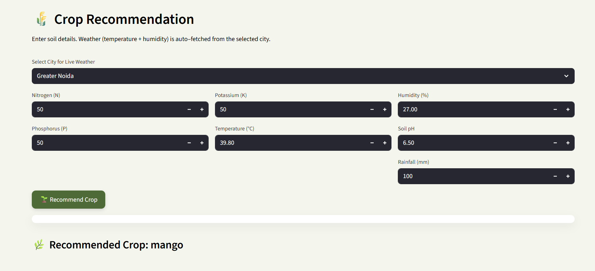
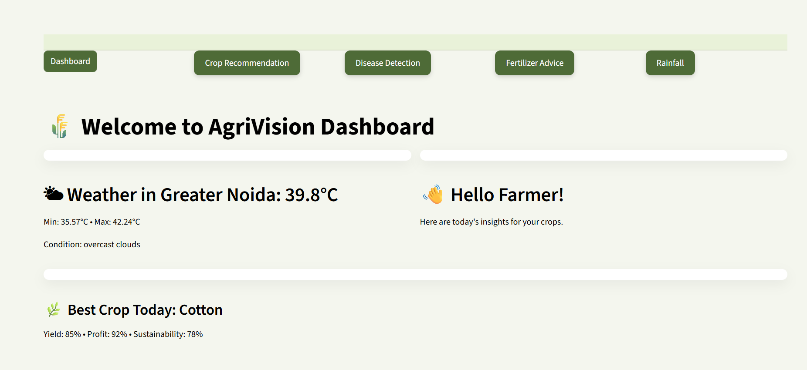
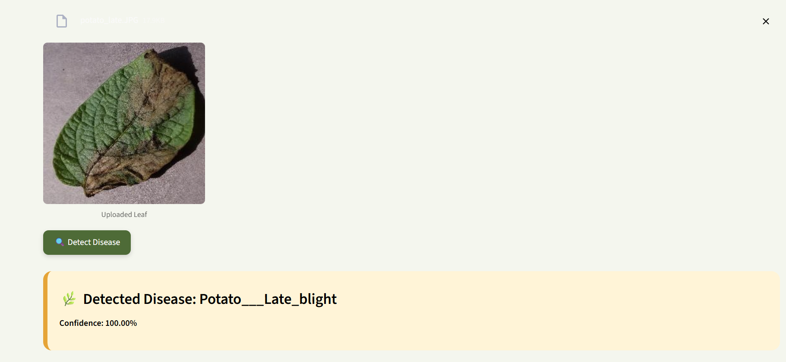
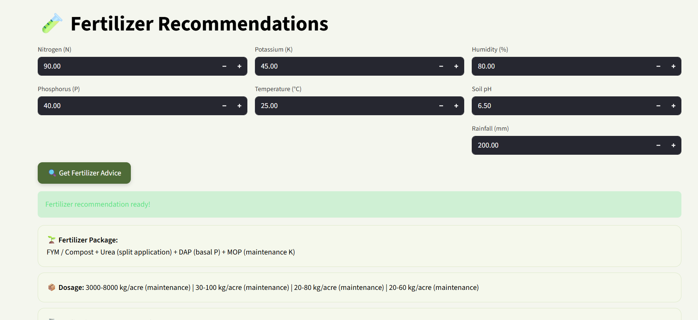
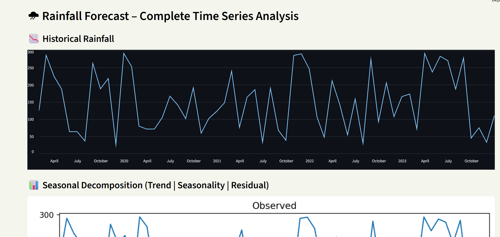

# AgriVision 🌾

A Smart Agriculture Recommendation System that helps farmers make informed decisions using Machine Learning and weather data.

## Features

* Crop recommendation based on soil and weather conditions
* Rainfall forecasting using ARIMA
* Real-time weather data integration
* User-friendly interface

## Tech Stack

**Python, FastAPI, XGBoost, ARIMA, Pandas, NumPy, Streamlit**

## Input Parameters

* Nitrogen (N)
* Phosphorus (P)
* Potassium (K)
* pH
* Temperature
* Humidity
* Rainfall

  ## 📸 Screenshots

  

  
  

  
  

## Future Improvements

* Fertilizer Recommendation
* Crop Disease Prediction
* Yield Prediction

## Author

Anushkaa Bhargava
